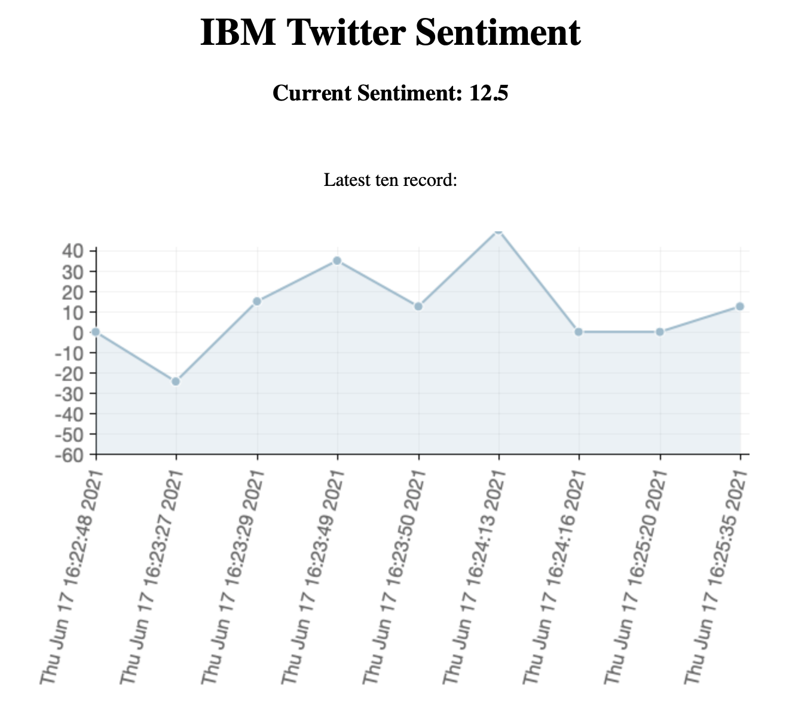

# Tweeter sentiment visualisation

* Tweet API
* Kafka = (Data streaming)
* IBM Cloudant Database
* Docker

### Kafka
```
cd kafka 
docker-compose up -d
```

### Producer
```
cd producer
docker build -t producer .
```

### Consumer
```
cd consumer
docker build -t consumer .
```

### Website
```
cd website
docker-compose up -d --build
```

## Next steps
* Deploy all the microservices on IBM Kubernetes 

## Example 
<p align="center">
    
</p>